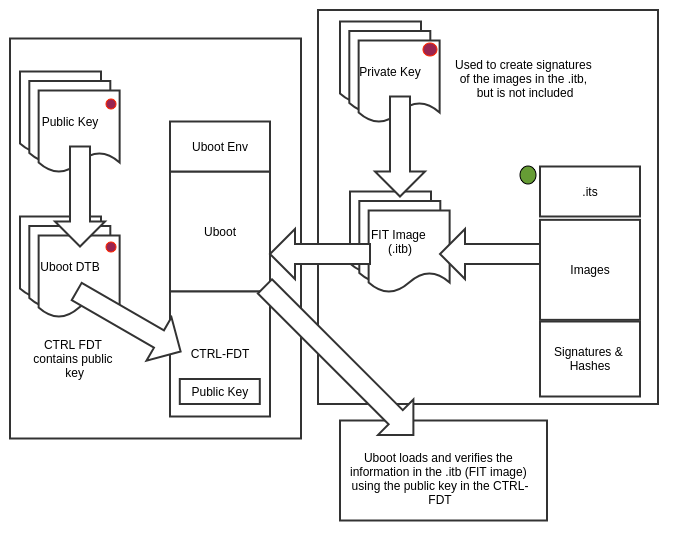

# VerifiedBoot
>Verified Boot of FIT image built using BuildRoot

## Getting Started

The Build-root platform has evolved over the years and finally with the support to build the kernel, u-boot along with the  capabilities to build FIT image made life easier for embedded systems. The developer just have to get the configuration straight and trigger the build for the Build-root to compile and deliver the aforementioned boot essentials 

| Components | Description |
| ---         |     ---      |
| U-boot | Primary Root of Trust |
| zImage | Non Secured World Image |
| ITB | Combination and signed copy of config, kernel,rootfs |
| RootFS | Non Secured Image |

For the i.mx platform the primary root of trust will be the hardware assisted High Assurance Boot (HAB), which serves the purpose of authenticating the boot process right from the moment processor comes out of reset. Following sequence diagram has been extracted from the NXP website to demonstrate verified boot sequence.




### Prerequisites

It is recommended to start with the following pre-requisite.

| S.No | Pre-Requisite |
| ---         |     ---      |
| 1.   | A decent x86_64 machine money can buy     |
| 2.   | Ubuntu 16.04 LTS running on the above       |
| 3.   | Internet connection     |
| 4.   | One Brain and Two Hands       |

```
- A decent x86_64 machine money can buy
- Ubuntu 16.04 LTS running on the above
- Internet connection
- One Brain and Two Hands
```

### nstalling

A step by step series of examples that tell you how to get a development env running

Say what the step will be

```
Give the example
```

And repeat

```
until finished
```

End with an example of getting some data out of the system or using it for a little demo

## Running the tests

Explain how to run the automated tests for this system

### Break down into end to end tests

Explain what these tests test and why

```
Give an example
```

### And coding style tests

Explain what these tests test and why

```
Give an example
```

## Deployment

Add additional notes about how to deploy this on a live system

## Built With

* [Dropwizard](http://www.dropwizard.io/1.0.2/docs/) - The web framework used
* [Maven](https://maven.apache.org/) - Dependency Management
* [ROME](https://rometools.github.io/rome/) - Used to generate RSS Feeds

## Authors

* **Pratap Maddimsetty** - [PratapMs GitHub](https://github.com/pratpms)

## License

This project is distributed under the [GPLV3 License](https://opensource.org/licenses/GPL-3.0)

## Acknowledgments

* Open Source Community

